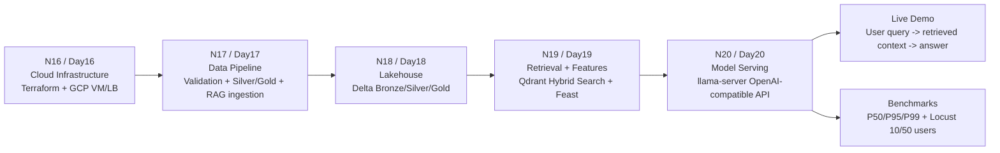
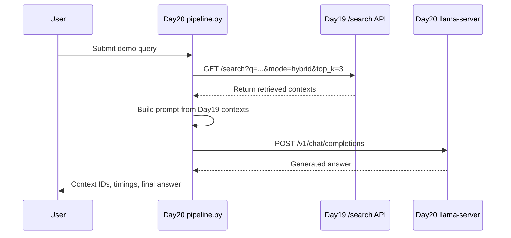
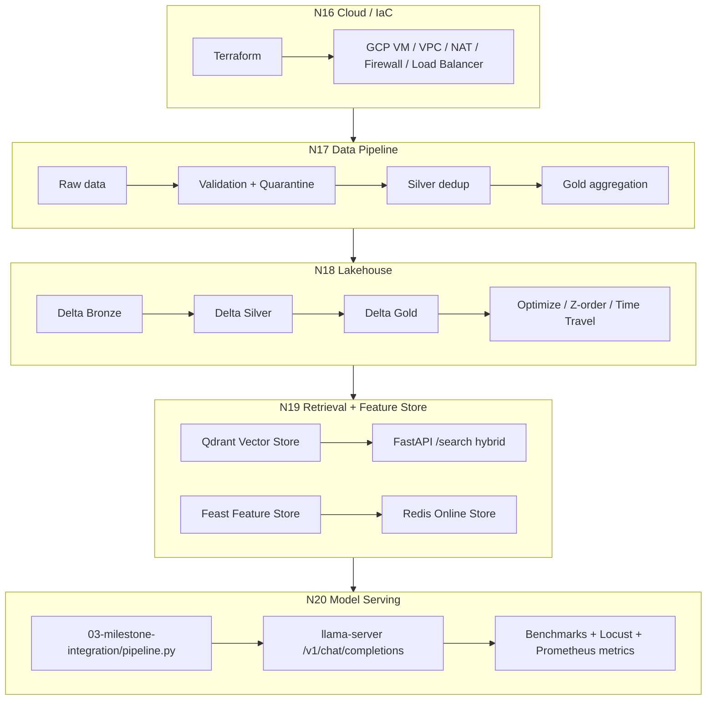

# Milestone 1 Architecture — AI Infrastructure Platform

## Platform view

## Runtime demo path

## Production architecture mapping

## Design rationale

This architecture keeps each daily lab as a platform component instead of treating the labs as isolated assignments.

- Day16 proves that infrastructure can be provisioned with Infrastructure as Code.
- Day17 proves that raw data can be validated, processed, deduplicated, and promoted into downstream datasets.
- Day18 proves that the platform has a Lakehouse layer with Delta tables, Medallion organization, optimization, and rollback concepts.
- Day19 provides the retrieval layer and feature-serving layer through hybrid search and Feast.
- Day20 provides the final serving layer through an OpenAI-compatible local inference endpoint.

The final live demo focuses on the serving path that can be run on the local machine:

Day19 hybrid retrieval -> Day20 prompt assembly -> Day20 llama-server answer.

## Deployment note

Day16 used GCP infrastructure and Terraform evidence. Day20 serving is demonstrated locally on the NVIDIA RTX 4060 Laptop GPU because the GCP project did not have available GPU quota. This is documented as a CPU/cloud fallback plus local GPU serving split.

## Files connected to this architecture

- `MILESTONE1.md`
- `integration/end_to_end_demo.md`
- `integration/runbook.md`
- `benchmarks/milestone1-latency-cost.md`
- `03-milestone-integration/pipeline.py`
- `benchmarks/03-real-integration-summary.md`
- `benchmarks/03-real-rag-pipeline-output.txt`
